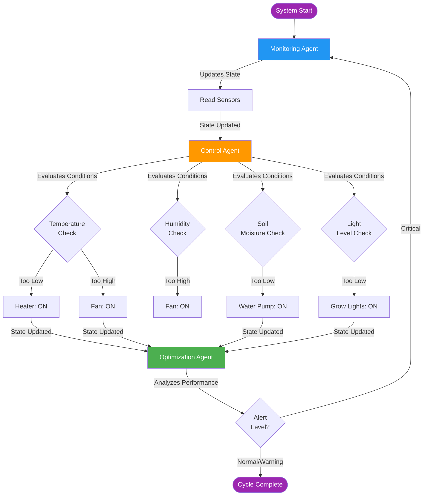

# CPS Automated Greenhouse System Using LangGraph & Ollama LLM

## Key Features

- **Multi-Agent Coordination**: Three agents working together
- **Shared State Management**: TypedDict state flows through workflow
- **Tool Use**: Agents use tools to interact with physical system
- **Autonomous Decision-Making**: Each agent makes independent decisions
- **Reactive Adaptation**: Workflow adapts based on system conditions
- **LLM-Augmented Control & Optimization:** Control and Optimization Agents use an LLM for smarter, explainable decisions
- **CPS Integration**: Demonstrates bridge between digital agents and physical world

## Why LangGraph

- **State Management:** Built-in state persistence across agent interactions enables seamless coordination between monitoring, control, and optimization agents without manual state handling.

- **Workflow Orchestration:** Declarative graph definition makes complex multi-agent workflows easy to understand, modify, and extend. Sequential and conditional edges provide fine-grained control flow.

- **Reactive Adaptation:** Conditional routing based on system state (alert levels) enables the workflow to adapt dynamically—critical alerts trigger immediate re-monitoring without waiting for the next cycle.

- **Extensible:** Swap simulated tools for real hardware interfaces (GPIO, I2C, SCADA) without changing the graph structure. Add new agents (e.g., predictive maintenance) by simply adding nodes.

- **Production-Ready:** Designed for building robust, scalable agentic systems with proper error handling, state checkpoints, and audit trails.

## How the LLM Is Used
This demo shows how LLMs **enhance a CPS:**

### LLM-Driven Control Policy (Control Agent)
- Uses an LLM to decide **ON/OFF** for:
  - heater, fan, water pump, grow lights
- Takes into account:
  - current sensor readings, current targets
  - recent monitoring & control logs (trends, oscillations, previous warnings)
- Returns both:
  - a structured JSON decision (actuator states, alert level)
  - a short **natural-language explanation** of the trade-offs (safety vs energy vs water vs stability)

### LLM-Driven Optimization (Optimization Agent)
- Uses an LLM to periodically adjust target parameters:
  - target temperature, humidity, soil moisture, light hours
- Reasons over:
  - recent system behavior (how often actuators are ON, oscillations, recent temps)
- Produces:
  - new target setpoints
  - an explanation of why these targets were changed (e.g., reduce actuator wear, avoid overwatering, reduce heating cost)


### Fallback

- If the **LLM is not available** (e.g., Ollama not running), the system:
  - logs an error
  - **automatically falls back** to deterministic, rule-based policies (classic control logic / state-machine-style behavior)

## How it Works/What's Included

- **State definition** (`GreenhouseState` TypedDict) - Shared state containing sensor readings, actuator states, target parameters, and agent logs

- **Sensor Tools** (`read_temperature`, `read_humidity`, `read_soil_moisture`, `read_light_level`) - Interface for reading physical sensors

- **Actuator Tools** (`set_heater`, `set_fan`, `set_water_pump`, `set_grow_lights`) - Interface for controlling physical devices

- **Nodes:** 
  - **Monitoring Agent** - Reads sensors, detects anomalies, sets alert levels
  - **Control Agent (LLM)** - Uses LLM policy to make real-time decisions, controls actuators based on sensor readings vs. targets
  - **Optimization Agent (LLM)** - Uses LLM policy to analyze performance, adjusts target parameters for efficiency

- **Graph wiring** - Sequential edges (monitor → control → optimize) with conditional routing (critical alerts loop back to monitor)

- **Demo Run:** Executes 5 simulation cycles showing autonomous operation, state flow, and reactive adaptation

### Workflow Graph
```
[Monitor] → [Control] → [Optimize] → (if critical) → [Monitor]
                              ↓
                            [END]
```

## Setup & Run

### 1. Create and activate a virtual environment

```bash
python -m venv .venv
source .venv/bin/activate      # Windows: .venv\Scripts\activate
```

### 2. Install Dependencies

```bash
pip install -r requirements.txt
```


### 3. Install and Run Ollama
a. Install Ollama from [website](https://ollama.com/download/mac)
b. Pull the model:
```bash
ollama pull llama3.1
```
c. Make sure Ollama server is running
```
ollama serve
```

### 4. Run the Demo

```bash
python greenhouse_cps.py
```

## Output

### Typical Run

```bash
======================================================================
CPS AUTOMATED GREENHOUSE SYSTEM - LangGraph Agentic Framework Demo
======================================================================

Initial State:
  Target Temperature: 24.0°C
  Target Humidity: 65.0%
  Target Soil Moisture: 60.0%

======================================================================
SIMULATION CYCLES
======================================================================

======================================================================
CYCLE 1
======================================================================

[Monitoring Agent] Reading sensors...
  [2025-11-13 15:14:53] Temp: 30.91°C, Humidity: 59.39%, Soil: 80.91%, Light: 13979.66 lux

[Control Agent] Evaluating control actions via LLM policy...
  [2025-11-13 15:14:53] Control actions (LLM): Heater OFF, Fan ON, Water pump OFF, Grow lights ON
  [2025-11-13 15:14:53] LLM Reason: Temperature is above target (30.91°C vs 24.0°C), but not critical yet. Humidity is low, so fan is on to increase it. Soil moisture is high, so water pump is off. Grow lights are on as per schedule. (alert_level=warning, soil_before=80.91, soil_after=80.91)

[Optimization Agent] Analyzing performance...
  [2025-11-13 15:14:53] LLM optimization: T=25.5°C, RH=62.0%, Soil=55.0%, LightHours=12
  [2025-11-13 15:14:53] LLM optimization reason: Relaxed temperature target by 1°C to reduce the likelihood of heater activation, while keeping humidity and soil moisture targets within acceptable ranges. Soil moisture is high, so a slight reduction in target should help prevent water pump overuse.

[Delta This Cycle] temperature: 22.0→30.91°C; humidity: 60.0→59.39%; soil_moisture: 50.0→80.91%; light_level: 5000.0→13979.66 lux; Fan: OFF→ON; Lights: OFF→ON; TargetTemp: 24.0→25.5; TargetRH: 65.0→62.0; TargetSoil: 60.0→55.0; Alert: NORMAL→WARNING

[System State After Cycle 1]
  Temperature: 30.91°C
  Humidity: 59.39%
  Soil Moisture: 80.91%
  Light Level: 13979.66 lux
  Alert Level: WARNING
  Actuators: Heater=False, Fan=True, Pump=False, Lights=True

Waiting 2 seconds before next cycle...

======================================================================
CYCLE 2
======================================================================

[Monitoring Agent] Reading sensors...
  [2025-11-13 15:15:13] Temp: 31.8°C, Humidity: 48.27%, Soil: 70.94%, Light: 7800.63 lux

[Control Agent] Evaluating control actions via LLM policy...
  [2025-11-13 15:15:13] Control actions (LLM): Heater OFF, Fan ON, Water pump OFF, Grow lights ON
  [2025-11-13 15:15:13] LLM Reason: Temperature is above target (31.8°C vs 25.5°C), and humidity is low (48.27% vs 62.0%). Fan is on to increase humidity, but heater is off to conserve energy. Grow lights are on as per schedule. (alert_level=warning, soil_before=70.94, soil_after=70.94)

[Optimization Agent] Analyzing performance...
  [2025-11-13 15:15:13] LLM optimization: T=26.5°C, RH=60.0%, Soil=58.0%, LightHours=12
  [2025-11-13 15:15:13] LLM optimization reason: Temperature is currently above the target, but not critical yet. To avoid overheating and reduce energy consumption, I'm relaxing the temperature target to 26.5°C. Humidity is low, so I'm keeping the fan on to increase it. Soil moisture is high, so I'm adjusting the water pump target slightly to prevent overwatering. Light hours remain unchanged as per schedule.

[Delta This Cycle] temperature: 30.91→31.8°C; humidity: 59.39→48.27%; soil_moisture: 80.91→70.94%; light_level: 13979.66→7800.63 lux; TargetTemp: 25.5→26.5; TargetRH: 62.0→60.0; TargetSoil: 55.0→58.0

[System State After Cycle 2]
  Temperature: 31.8°C
  Humidity: 48.27%
  Soil Moisture: 70.94%
  Light Level: 7800.63 lux
  Alert Level: WARNING
  Actuators: Heater=False, Fan=True, Pump=False, Lights=True

Waiting 2 seconds before next cycle...

======================================================================
CYCLE 3
======================================================================

[Monitoring Agent] Reading sensors...
  [2025-11-13 15:15:32] Temp: 18.54°C, Humidity: 80.08%, Soil: 53.08%, Light: 4565.33 lux

[Control Agent] Evaluating control actions via LLM policy...
  [2025-11-13 15:15:32] Control actions (LLM): Heater OFF, Fan ON, Water pump OFF, Grow lights ON
  [2025-11-13 15:15:32] LLM Reason: Temperature is below target (18.54°C vs 26.5°C), but humidity is high and soil moisture is low, so fan is on to increase air circulation and water pump is off to conserve water. Grow lights are on as per schedule. (alert_level=warning, soil_before=53.08, soil_after=53.08)

[Optimization Agent] Analyzing performance...
  [2025-11-13 15:15:32] LLM optimization: T=25.0°C, RH=65.0%, Soil=55.0%, LightHours=12
  [2025-11-13 15:15:32] LLM optimization reason: Relaxed temperature target to 25°C to reduce energy usage, while keeping humidity and soil moisture targets within acceptable ranges. Soil moisture is currently low (53.08%), so a slightly lower target should help avoid excessive water usage without compromising plant health.

[Delta This Cycle] temperature: 31.8→18.54°C; humidity: 48.27→80.08%; soil_moisture: 70.94→53.08%; light_level: 7800.63→4565.33 lux; TargetTemp: 26.5→25.0; TargetRH: 60.0→65.0; TargetSoil: 58.0→55.0

[System State After Cycle 3]
  Temperature: 18.54°C
  Humidity: 80.08%
  Soil Moisture: 53.08%
  Light Level: 4565.33 lux
  Alert Level: WARNING
  Actuators: Heater=False, Fan=True, Pump=False, Lights=True

Waiting 2 seconds before next cycle...

======================================================================
CYCLE 4
======================================================================

[Monitoring Agent] Reading sensors...
  [2025-11-13 15:15:52] Temp: 24.98°C, Humidity: 69.2%, Soil: 75.38%, Light: 5645.08 lux

[Control Agent] Evaluating control actions via LLM policy...
  [2025-11-13 15:15:52] Control actions (LLM): Heater OFF, Fan ON, Water pump OFF, Grow lights ON
  [2025-11-13 15:15:52] LLM Reason: Temperature is slightly below target (24.98°C vs 25.0°C), but humidity and soil moisture are within safe ranges. Fan is on to maintain air circulation, grow lights are on as per schedule. Recent history shows temperature fluctuations between 18.54°C and 31.8°C. (alert_level=warning, soil_before=75.38, soil_after=75.38)

[Optimization Agent] Analyzing performance...
  [2025-11-13 15:15:52] LLM optimization: T=22.5°C, RH=60.0%, Soil=50.0%, LightHours=12
  [2025-11-13 15:15:52] LLM optimization reason: Relaxed temperature target to 22.5°C to reduce risk of overheating, while keeping humidity and soil moisture targets within acceptable ranges. Actuator wear is a concern due to frequent ON/OFF cycling; slightly relaxing the temperature target should help mitigate this issue.

[Delta This Cycle] temperature: 18.54→24.98°C; humidity: 80.08→69.2%; soil_moisture: 53.08→75.38%; light_level: 4565.33→5645.08 lux; TargetTemp: 25.0→22.5; TargetRH: 65.0→60.0; TargetSoil: 55.0→50.0

[System State After Cycle 4]
  Temperature: 24.98°C
  Humidity: 69.2%
  Soil Moisture: 75.38%
  Light Level: 5645.08 lux
  Alert Level: WARNING
  Actuators: Heater=False, Fan=True, Pump=False, Lights=True

Waiting 2 seconds before next cycle...

======================================================================
CYCLE 5
======================================================================

[Monitoring Agent] Reading sensors...
  [2025-11-13 15:16:13] Temp: 28.51°C, Humidity: 77.57%, Soil: 75.48%, Light: 13384.97 lux

[Control Agent] Evaluating control actions via LLM policy...
  [2025-11-13 15:16:13] Control actions (LLM): Heater OFF, Fan ON, Water pump OFF, Grow lights ON
  [2025-11-13 15:16:13] LLM Reason: Temperature is above target (28.51°C vs 22.5°C), but humidity and soil moisture are within safe ranges. Fan is on to maintain air circulation, grow lights are on as per schedule. Recent history shows temperature fluctuations between 18.54°C and 31.8°C. (alert_level=warning, soil_before=75.48, soil_after=75.48)

[Optimization Agent] Analyzing performance...
  [2025-11-13 15:16:13] LLM optimization: T=23.0°C, RH=65.0%, Soil=55.0%, LightHours=12
  [2025-11-13 15:16:13] LLM optimization reason: Temperature is currently above target, but recent fluctuations suggest it's not critical to adjust the target aggressively. Humidity has been low in recent logs, so increasing the target slightly should help maintain air circulation without overcooling. Soil moisture has been high, so reducing the target will encourage water pump usage and prevent extreme dryness. Light hours remain unchanged as they are already at the scheduled value.

[Delta This Cycle] temperature: 24.98→28.51°C; humidity: 69.2→77.57%; soil_moisture: 75.38→75.48%; light_level: 5645.08→13384.97 lux; TargetTemp: 22.5→23.0; TargetRH: 60.0→65.0; TargetSoil: 50.0→55.0

[System State After Cycle 5]
  Temperature: 28.51°C
  Humidity: 77.57%
  Soil Moisture: 75.48%
  Light Level: 13384.97 lux
  Alert Level: WARNING
  Actuators: Heater=False, Fan=True, Pump=False, Lights=True

======================================================================
SYSTEM SUMMARY
======================================================================

Total Monitoring Entries: 5
Total Control Actions: 10
Total Optimizations: 10

======================================================================
AGENTIC AI STACK ANALYSIS
======================================================================

    ┌─────────────────────────────────────────────────────────────┐
    │ AGENTIC AI STACK IN CPS GREENHOUSE SYSTEM                   │
    └─────────────────────────────────────────────────────────────┘

    1. PLANNING LAYER
       └─ LangGraph StateGraph defines the workflow structure
          • Nodes: monitor → control → optimize
          • Conditional routing based on alert levels
          • Enables dynamic decision-making

    2. EXECUTION LAYER
       └─ Three specialized agents with tools:
          • Monitoring Agent: Sensor reading tools (temperature, humidity, etc.)
          • Control Agent: Actuator control tools (heater, fan, pump, lights)
          • Optimization Agent: Analysis and parameter tuning
          • Each agent operates autonomously but coordinates through shared state

    3. MEMORY LAYER
       └─ GreenhouseState (TypedDict) maintains:
          • Sensor readings (current state)
          • Actuator states (control outputs)
          • Agent logs (historical decisions)
          • System parameters (targets and configurations)
          • Messages (inter-agent communication)

    4. FEEDBACK LAYER
       └─ Continuous adaptation through:
          • Real-time sensor monitoring → state updates
          • Control decisions → actuator actions → environmental changes
          • Optimization analysis → parameter adjustments
          • Alert detection → workflow rerouting

    5. TOOL LAYER (LangChain Tools)
       └─ Physical world interface:
          • read_temperature, read_humidity, read_soil_moisture, read_light_level
          • set_heater, set_fan, set_water_pump, set_grow_lights
          • Tools bridge the digital agents with physical CPS components

    KEY AGENTIC PRINCIPLES DEMONSTRATED:
    ✓ Multi-agent coordination
    ✓ Shared state management
    ✓ Tool use for CPS actuation
    ✓ Autonomous decision-making
    ✓ Reactive workflow adaptation
    ✓ Continuous monitoring and optimization
```

### Critical Alert Scenario

When critical conditions are detected, the workflow adapts:

```bash
[Monitoring Agent] Reading sensors...
  [2025-11-04 14:38:04] Temp: 31.5°C, Humidity: 43.41%, Soil: 63.95%, Light: 11461.36 lux
  ALERT (CRITICAL): Anomaly detected!

[Control Agent] Evaluating control actions...
  [2025-11-04 14:38:04] Control actions: Heater OFF, Fan ON, Water pump OFF, Grow lights OFF

[Optimization Agent] Analyzing performance...
  [2025-11-04 14:38:04] System operating efficiently

[Monitoring Agent] Reading sensors...  ← Immediate re-monitoring due to critical alert
  [2025-11-04 14:38:04] Temp: 18.91°C, Humidity: 70.26%, Soil: 52.57%, Light: 2795.77 lux
```

## Agentic AI Stack Mapping

### 1. Planning Layer
- **LangGraph StateGraph**: Defines the overall workflow structure
- **Nodes**: Each agent is a node in the graph
- **Edges**: Define the flow of control between agents
- **Conditional Edges**: Enable dynamic routing based on system state

### 2. Execution Layer
- **Agent Nodes**: Three specialized agents execute their respective tasks
- **Tools**: LangChain tools interface with physical CPS components
  - Sensor tools: `read_temperature()`, `read_humidity()`, etc.
  - Actuator tools: `set_heater()`, `set_fan()`, etc.
- **Autonomous Operation**: Each agent makes decisions independently

### 3. Memory Layer
- **Shared State** (`GreenhouseState` TypedDict):
  - Current sensor readings
  - Actuator states
  - Target parameters
  - Agent logs and messages
  - System status and alerts
- **State Persistence**: State flows through the graph, enabling agent coordination

### 4. Feedback Layer
- **Continuous Monitoring**: Monitoring agent continuously updates state
- **Control Feedback**: Control actions affect environment, which is sensed again
- **Adaptive Optimization**: Optimization agent adjusts targets based on performance
- **Alert-Driven Adaptation**: Critical conditions trigger workflow rerouting

### 5. Tool Layer
- **Sensor Tools**: Bridge to physical sensors (simulated in this demo)
- **Actuator Tools**: Bridge to physical actuators (simulated in this demo)
- **CPS Interface**: Tools represent the boundary between digital agents and physical world

## Architecture Diagram

**More diagrams can be found at [diagrams.md](https://github.com/ranadubauskas/agentic-demo/blob/main/diagrams.md)**

**Core Workflow Diagram:**

