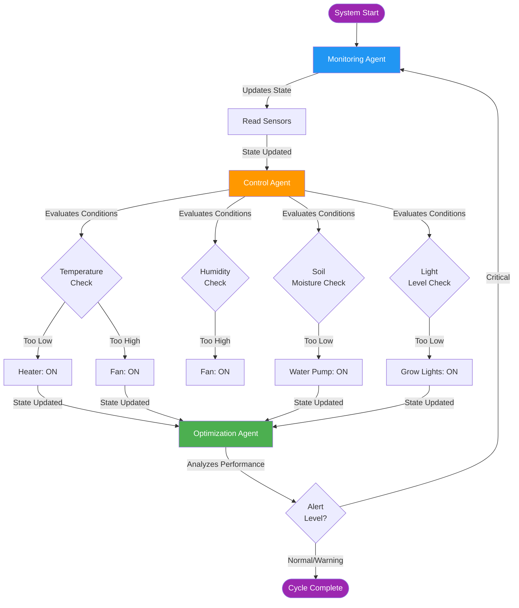

# CPS Automated Greenhouse System Using LangGraph

## Key Features

- **Multi-Agent Coordination**: Three agents working together
- **Shared State Management**: TypedDict state flows through workflow
- **Tool Use**: Agents use tools to interact with physical system
- **Autonomous Decision-Making**: Each agent makes independent decisions
- **Reactive Adaptation**: Workflow adapts based on system conditions
- **CPS Integration**: Demonstrates bridge between digital agents and physical world

## Why LangGraph

- **State Management:** Built-in state persistence across agent interactions enables seamless coordination between monitoring, control, and optimization agents without manual state handling.

- **Workflow Orchestration:** Declarative graph definition makes complex multi-agent workflows easy to understand, modify, and extend. Sequential and conditional edges provide fine-grained control flow.

- **Reactive Adaptation:** Conditional routing based on system state (alert levels) enables the workflow to adapt dynamically—critical alerts trigger immediate re-monitoring without waiting for the next cycle.

- **Extensible:** Swap simulated tools for real hardware interfaces (GPIO, I2C, SCADA) without changing the graph structure. Add new agents (e.g., predictive maintenance) by simply adding nodes.

- **Production-Ready:** Designed for building robust, scalable agentic systems with proper error handling, state checkpoints, and audit trails.

## How it Works/What's Included

- **State definition** (`GreenhouseState` TypedDict) - Shared state containing sensor readings, actuator states, target parameters, and agent logs

- **Sensor Tools** (`read_temperature`, `read_humidity`, `read_soil_moisture`, `read_light_level`) - Interface for reading physical sensors

- **Actuator Tools** (`set_heater`, `set_fan`, `set_water_pump`, `set_grow_lights`) - Interface for controlling physical devices

- **Nodes:** 
  - **Monitoring Agent** - Reads sensors, detects anomalies, sets alert levels
  - **Control Agent** - Makes real-time decisions, controls actuators based on sensor readings vs. targets
  - **Optimization Agent** - Analyzes performance, adjusts target parameters for efficiency

- **Graph wiring** - Sequential edges (monitor → control → optimize) with conditional routing (critical alerts loop back to monitor)

- **Demo Run:** Executes 5 simulation cycles showing autonomous operation, state flow, and reactive adaptation

### Workflow Graph
```
[Monitor] → [Control] → [Optimize] → (if critical) → [Monitor]
                              ↓
                            [END]
```

## Setup & Run

### 1. Create and activate a virtual environment

```bash
python -m venv .venv
source .venv/bin/activate      # Windows: .venv\Scripts\activate
```

### 2. Install Dependencies

```bash
pip install -r requirements.txt
```

### 3. Configure API Key (Optional)

Create a `.env` file in the project root:

```
OPENAI_API_KEY=your_openai_api_key_here
```

**Note:** The system works without an API key using deterministic agent logic. The API key is optional for enhanced LLM-based decision-making.

### 4. Run the Demo

```bash
python greenhouse_cps.py
```

## Output

### Typical Run

```bash
======================================================================
CPS AUTOMATED GREENHOUSE SYSTEM - LangGraph Agentic Framework Demo
======================================================================

Initial State:
  Target Temperature: 24.0°C
  Target Humidity: 65.0%
  Target Soil Moisture: 60.0%

======================================================================
SIMULATION CYCLES
======================================================================

======================================================================
CYCLE 1
======================================================================

[Monitoring Agent] Reading sensors...
  [2025-11-04 17:14:24] Temp: 28.94°C, Humidity: 78.68%, Soil: 37.7%, Light: 2888.35 lux

[Control Agent] Evaluating control actions...
  [2025-11-04 17:14:24] Control actions: Heater OFF, Fan ON, Fan ON, Water pump ON, Grow lights OFF
  [2025-11-04 17:14:24] Reasons:
  • Fan ON, Heater OFF because T=28.94 > 26.0 (target+2)
  • Fan ON due to RH=78.68 > 70.0 (target+5)
  • Pump ON because soil=37.7 < 55.0; soil 37.7→52.7
  • Lights OFF because light=2888.35 ≥ 1000 lux

[Optimization Agent] Analyzing performance...
  [2025-11-04 17:14:24] System stable, no optimization needed (recent_actions=2 (≤3))

[Delta This Cycle] temperature: 22.0→28.94°C; humidity: 60.0→78.68%; soil_moisture: 50.0→52.7%; light_level: 5000.0→2888.35 lux; Fan: OFF→ON; Pump: OFF→ON
[Control Why] [2025-11-04 17:14:24] Reasons:
  • Fan ON, Heater OFF because T=28.94 > 26.0 (target+2)
  • Fan ON due to RH=78.68 > 70.0 (target+5)
  • Pump ON because soil=37.7 < 55.0; soil 37.7→52.7
  • Lights OFF because light=2888.35 ≥ 1000 lux

[System State After Cycle 1]
  Temperature: 28.94°C
  Humidity: 78.68%
  Soil Moisture: 52.7%
  Light Level: 2888.35 lux
  Alert Level: NORMAL
  Actuators: Heater=False, Fan=True, Pump=True, Lights=False

Waiting 2 seconds before next cycle...

======================================================================
CYCLE 2
======================================================================

[Monitoring Agent] Reading sensors...
  [2025-11-04 17:14:26] Temp: 18.58°C, Humidity: 87.23%, Soil: 46.0%, Light: 3533.96 lux

[Control Agent] Evaluating control actions...
  [2025-11-04 17:14:26] Control actions: Heater ON, Fan ON, Water pump ON, Grow lights OFF
  [2025-11-04 17:14:26] Reasons:
  • Heater ON because T=18.58 < 22.0 (target-2)
  • Fan ON due to RH=87.23 > 70.0 (target+5)
  • Pump ON because soil=46.0 < 55.0; soil 46.0→61.0
  • Lights OFF because light=3533.96 ≥ 1000 lux

[Optimization Agent] Analyzing performance...
  [2025-11-04 17:14:26] System operating efficiently (recent_actions=4 but |T-Target|≥1)

[Delta This Cycle] temperature: 28.94→18.58°C; humidity: 78.68→87.23%; soil_moisture: 52.7→61.0%; light_level: 2888.35→3533.96 lux; Heater: OFF→ON; Alert: NORMAL→WARNING
[Control Why] [2025-11-04 17:14:26] Reasons:
  • Heater ON because T=18.58 < 22.0 (target-2)
  • Fan ON due to RH=87.23 > 70.0 (target+5)
  • Pump ON because soil=46.0 < 55.0; soil 46.0→61.0
  • Lights OFF because light=3533.96 ≥ 1000 lux

[System State After Cycle 2]
  Temperature: 18.58°C
  Humidity: 87.23%
  Soil Moisture: 61.0%
  Light Level: 3533.96 lux
  Alert Level: WARNING
  Actuators: Heater=True, Fan=True, Pump=True, Lights=False

Waiting 2 seconds before next cycle...

======================================================================
CYCLE 3
======================================================================

[Monitoring Agent] Reading sensors...
  [2025-11-04 17:14:28] Temp: 23.19°C, Humidity: 76.76%, Soil: 83.37%, Light: 8835.87 lux

[Control Agent] Evaluating control actions...
  [2025-11-04 17:14:28] Control actions: Heater OFF, Fan OFF, Fan ON, Water pump OFF, Grow lights OFF
  [2025-11-04 17:14:28] Reasons:
  • T in band [22.0,26.0] → Heater OFF, Fan OFF
  • Fan ON due to RH=76.76 > 70.0 (target+5)
  • Pump OFF because soil=83.37 ≥ 55.0
  • Lights OFF because light=8835.87 ≥ 1000 lux

[Optimization Agent] Analyzing performance...
  [2025-11-04 17:14:28] Adjusted target temp for efficiency (recent_actions=5 (>3) and |T-Target|<1)

[Delta This Cycle] temperature: 18.58→23.19°C; humidity: 87.23→76.76%; soil_moisture: 61.0→83.37%; light_level: 3533.96→8835.87 lux; Heater: ON→OFF; Pump: ON→OFF; TargetTemp: 24.0→24.5; Alert: WARNING→NORMAL
[Control Why] [2025-11-04 17:14:28] Reasons:
  • T in band [22.0,26.0] → Heater OFF, Fan OFF
  • Fan ON due to RH=76.76 > 70.0 (target+5)
  • Pump OFF because soil=83.37 ≥ 55.0
  • Lights OFF because light=8835.87 ≥ 1000 lux

[System State After Cycle 3]
  Temperature: 23.19°C
  Humidity: 76.76%
  Soil Moisture: 83.37%
  Light Level: 8835.87 lux
  Alert Level: NORMAL
  Actuators: Heater=False, Fan=True, Pump=False, Lights=False

Waiting 2 seconds before next cycle...

======================================================================
CYCLE 4
======================================================================

[Monitoring Agent] Reading sensors...
  [2025-11-04 17:14:30] Temp: 24.08°C, Humidity: 87.57%, Soil: 50.46%, Light: 12342.33 lux

[Control Agent] Evaluating control actions...
  [2025-11-04 17:14:30] Control actions: Heater OFF, Fan OFF, Fan ON, Water pump ON, Grow lights OFF
  [2025-11-04 17:14:30] Reasons:
  • T in band [22.5,26.5] → Heater OFF, Fan OFF
  • Fan ON due to RH=87.57 > 70.0 (target+5)
  • Pump ON because soil=50.46 < 55.0; soil 50.46→65.46000000000001
  • Lights OFF because light=12342.33 ≥ 1000 lux

[Optimization Agent] Analyzing performance...
  [2025-11-04 17:14:30] Adjusted target temp for efficiency (recent_actions=5 (>3) and |T-Target|<1)

[Delta This Cycle] temperature: 23.19→24.08°C; humidity: 76.76→87.57%; soil_moisture: 83.37→65.46000000000001%; light_level: 8835.87→12342.33 lux; Pump: OFF→ON; TargetTemp: 24.5→25.0; Alert: NORMAL→WARNING
[Control Why] [2025-11-04 17:14:30] Reasons:
  • T in band [22.5,26.5] → Heater OFF, Fan OFF
  • Fan ON due to RH=87.57 > 70.0 (target+5)
  • Pump ON because soil=50.46 < 55.0; soil 50.46→65.46000000000001
  • Lights OFF because light=12342.33 ≥ 1000 lux

[System State After Cycle 4]
  Temperature: 24.08°C
  Humidity: 87.57%
  Soil Moisture: 65.46000000000001%
  Light Level: 12342.33 lux
  Alert Level: WARNING
  Actuators: Heater=False, Fan=True, Pump=True, Lights=False

Waiting 2 seconds before next cycle...

======================================================================
CYCLE 5
======================================================================

[Monitoring Agent] Reading sensors...
  [2025-11-04 17:14:32] Temp: 24.85°C, Humidity: 51.84%, Soil: 84.42%, Light: 8268.32 lux

[Control Agent] Evaluating control actions...
  [2025-11-04 17:14:32] Control actions: Heater OFF, Fan OFF, Water pump OFF, Grow lights OFF
  [2025-11-04 17:14:32] Reasons:
  • T in band [23.0,27.0] → Heater OFF, Fan OFF
  • Pump OFF because soil=84.42 ≥ 55.0
  • Lights OFF because light=8268.32 ≥ 1000 lux

[Optimization Agent] Analyzing performance...
  [2025-11-04 17:14:32] System stable, no optimization needed (recent_actions=3 (≤3))

[Delta This Cycle] temperature: 24.08→24.85°C; humidity: 87.57→51.84%; soil_moisture: 65.46000000000001→84.42%; light_level: 12342.33→8268.32 lux; Fan: ON→OFF; Pump: ON→OFF; Alert: WARNING→NORMAL
[Control Why] [2025-11-04 17:14:32] Reasons:
  • T in band [23.0,27.0] → Heater OFF, Fan OFF
  • Pump OFF because soil=84.42 ≥ 55.0
  • Lights OFF because light=8268.32 ≥ 1000 lux

[System State After Cycle 5]
  Temperature: 24.85°C
  Humidity: 51.84%
  Soil Moisture: 84.42%
  Light Level: 8268.32 lux
  Alert Level: NORMAL
  Actuators: Heater=False, Fan=False, Pump=False, Lights=False

======================================================================
SYSTEM SUMMARY
======================================================================

Total Monitoring Entries: 5
Total Control Actions: 10
Total Optimizations: 5

======================================================================
AGENTIC AI STACK ANALYSIS
======================================================================

    ┌─────────────────────────────────────────────────────────────┐
    │ AGENTIC AI STACK IN CPS GREENHOUSE SYSTEM                   │
    └─────────────────────────────────────────────────────────────┘

    1. PLANNING LAYER
       └─ LangGraph StateGraph defines the workflow structure
          • Nodes: monitor → control → optimize
          • Conditional routing based on alert levels
          • Enables dynamic decision-making

    2. EXECUTION LAYER
       └─ Three specialized agents with tools:
          • Monitoring Agent: Sensor reading tools (temperature, humidity, etc.)
          • Control Agent: Actuator control tools (heater, fan, pump, lights)
          • Optimization Agent: Analysis and parameter tuning
          • Each agent operates autonomously but coordinates through shared state

    3. MEMORY LAYER
       └─ GreenhouseState (TypedDict) maintains:
          • Sensor readings (current state)
          • Actuator states (control outputs)
          • Agent logs (historical decisions)
          • System parameters (targets and configurations)
          • Messages (inter-agent communication)

    4. FEEDBACK LAYER
       └─ Continuous adaptation through:
          • Real-time sensor monitoring → state updates
          • Control decisions → actuator actions → environmental changes
          • Optimization analysis → parameter adjustments
          • Alert detection → workflow rerouting

    5. TOOL LAYER (LangChain Tools)
       └─ Physical world interface:
          • read_temperature, read_humidity, read_soil_moisture, read_light_level
          • set_heater, set_fan, set_water_pump, set_grow_lights
          • Tools bridge the digital agents with physical CPS components

    KEY AGENTIC PRINCIPLES DEMONSTRATED:
    ✓ Multi-agent coordination
    ✓ Shared state management
    ✓ Tool use for CPS actuation
    ✓ Autonomous decision-making
    ✓ Reactive workflow adaptation
    ✓ Continuous monitoring and optimization
```

### Critical Alert Scenario

When critical conditions are detected, the workflow adapts:

```bash
[Monitoring Agent] Reading sensors...
  [2025-11-04 14:38:04] Temp: 31.5°C, Humidity: 43.41%, Soil: 63.95%, Light: 11461.36 lux
  ALERT (CRITICAL): Anomaly detected!

[Control Agent] Evaluating control actions...
  [2025-11-04 14:38:04] Control actions: Heater OFF, Fan ON, Water pump OFF, Grow lights OFF

[Optimization Agent] Analyzing performance...
  [2025-11-04 14:38:04] System operating efficiently

[Monitoring Agent] Reading sensors...  ← Immediate re-monitoring due to critical alert
  [2025-11-04 14:38:04] Temp: 18.91°C, Humidity: 70.26%, Soil: 52.57%, Light: 2795.77 lux
```

## Agentic AI Stack Mapping

### 1. Planning Layer
- **LangGraph StateGraph**: Defines the overall workflow structure
- **Nodes**: Each agent is a node in the graph
- **Edges**: Define the flow of control between agents
- **Conditional Edges**: Enable dynamic routing based on system state

### 2. Execution Layer
- **Agent Nodes**: Three specialized agents execute their respective tasks
- **Tools**: LangChain tools interface with physical CPS components
  - Sensor tools: `read_temperature()`, `read_humidity()`, etc.
  - Actuator tools: `set_heater()`, `set_fan()`, etc.
- **Autonomous Operation**: Each agent makes decisions independently

### 3. Memory Layer
- **Shared State** (`GreenhouseState` TypedDict):
  - Current sensor readings
  - Actuator states
  - Target parameters
  - Agent logs and messages
  - System status and alerts
- **State Persistence**: State flows through the graph, enabling agent coordination

### 4. Feedback Layer
- **Continuous Monitoring**: Monitoring agent continuously updates state
- **Control Feedback**: Control actions affect environment, which is sensed again
- **Adaptive Optimization**: Optimization agent adjusts targets based on performance
- **Alert-Driven Adaptation**: Critical conditions trigger workflow rerouting

### 5. Tool Layer
- **Sensor Tools**: Bridge to physical sensors (simulated in this demo)
- **Actuator Tools**: Bridge to physical actuators (simulated in this demo)
- **CPS Interface**: Tools represent the boundary between digital agents and physical world

## Architecture Diagram

**More diagrams can be found at [diagrams.md](https://github.com/ranadubauskas/agentic-demo/blob/main/diagrams.md)**

Core Workflow Diagram:

