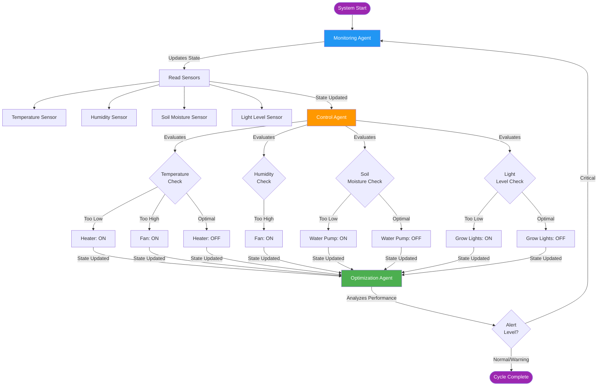
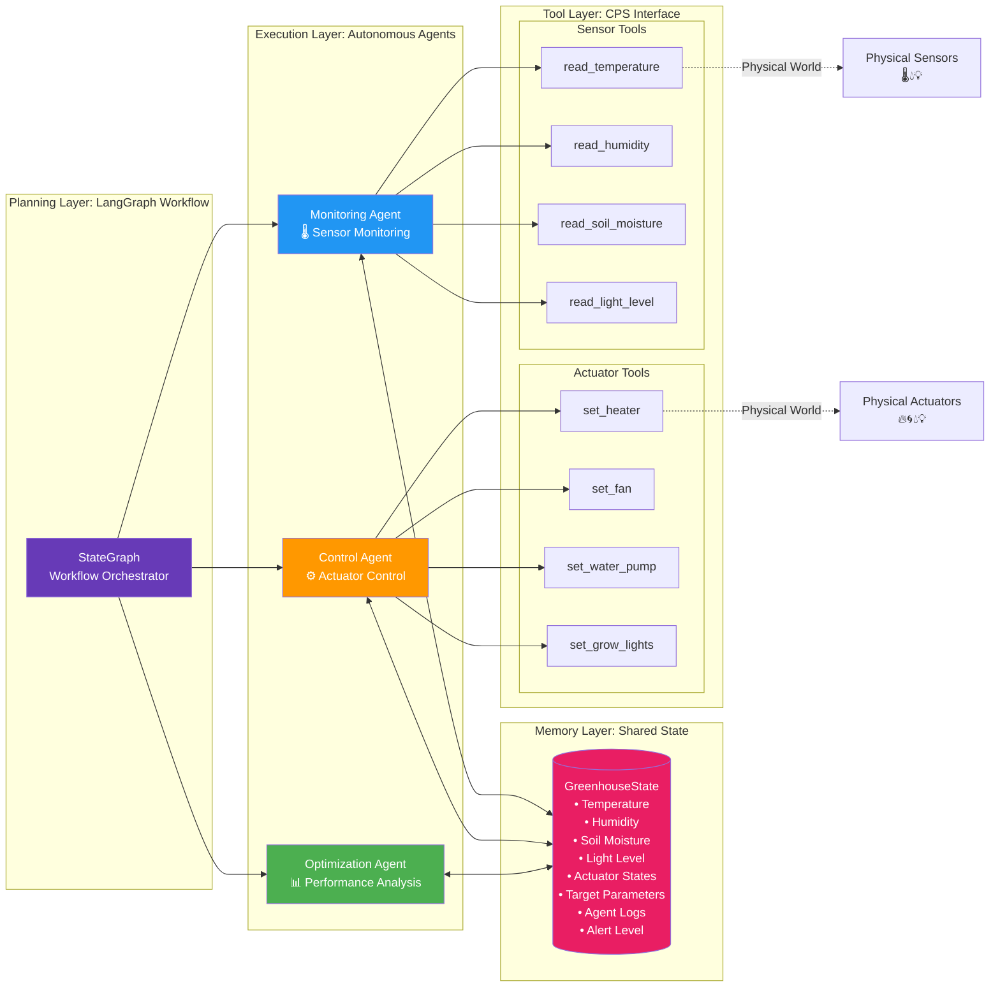
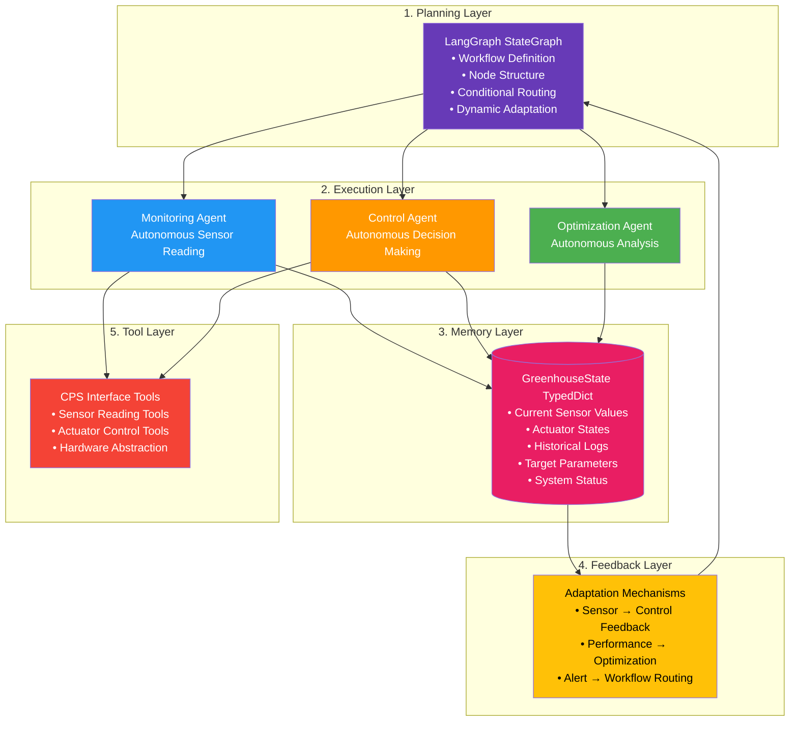
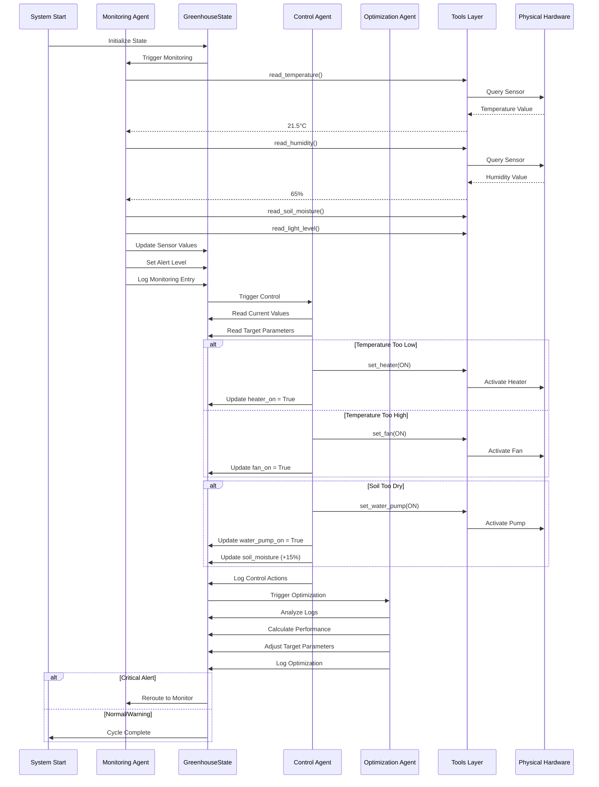
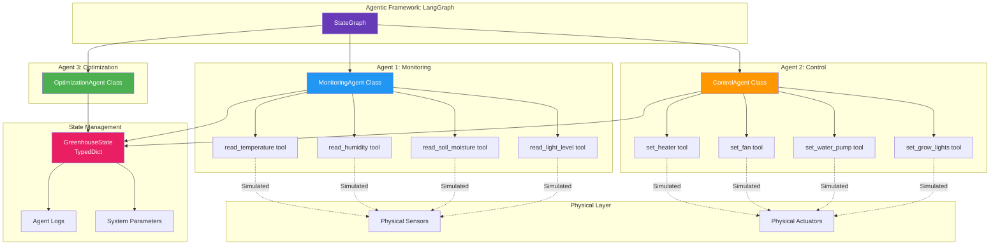
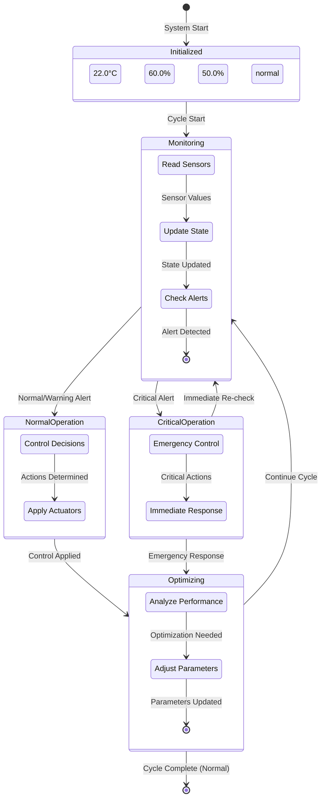
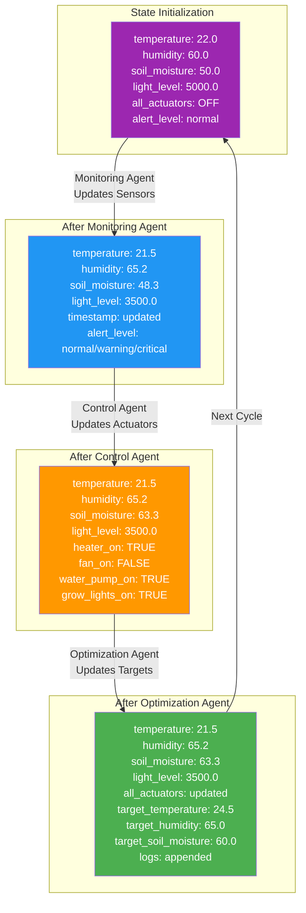

# CPS Greenhouse System Architecture Diagrams

## System Workflow Architecture

## Agent Architecture with Tools

## Agentic AI Stack Layers

## State Flow Diagram

## Component Interaction Diagram

## State Machine Diagram (State Transitions)

This diagram shows how the GreenhouseState transitions through different states during execution:

## Detailed State Evolution Diagram

This shows how individual state fields change through the workflow:

