# CPS Greenhouse System Architecture Diagrams

## System Workflow Architecture


## Agent Architecture with Tools

```mermaid
graph LR
    subgraph "Planning Layer: LangGraph Workflow"
        Workflow[StateGraph<br/>Workflow Orchestrator]
    end
    
    subgraph "Execution Layer: Autonomous Agents"
        Monitor[Monitoring Agent<br/>🌡️ Sensor Monitoring]
        Control[Control Agent<br/>⚙️ Actuator Control]
        Optimize[Optimization Agent<br/>📊 Performance Analysis]
    end
    
    subgraph "Memory Layer: Shared State"
        State[(GreenhouseState<br/>• Temperature<br/>• Humidity<br/>• Soil Moisture<br/>• Light Level<br/>• Actuator States<br/>• Target Parameters<br/>• Agent Logs<br/>• Alert Level)]
    end
    
    subgraph "Tool Layer: CPS Interface"
        subgraph "Sensor Tools"
            TTool[read_temperature]
            HTool[read_humidity]
            STool[read_soil_moisture]
            LTool[read_light_level]
        end
        
        subgraph "Actuator Tools"
            HeaterTool[set_heater]
            FanTool[set_fan]
            PumpTool[set_water_pump]
            LightTool[set_grow_lights]
        end
    end
    
    Workflow --> Monitor
    Workflow --> Control
    Workflow --> Optimize
    
    Monitor --> TTool
    Monitor --> HTool
    Monitor --> STool
    Monitor --> LTool
    
    Control --> HeaterTool
    Control --> FanTool
    Control --> PumpTool
    Control --> LightTool
    
    Monitor <--> State
    Control <--> State
    Optimize <--> State
    
    TTool -.->|Physical World| Sensors[Physical Sensors<br/>🌡️💧💡]
    HeaterTool -.->|Physical World| Actuators[Physical Actuators<br/>🔥🌀💧💡]
    
    style Monitor fill:#2196F3,color:#ffffff
    style Control fill:#FF9800,color:#ffffff
    style Optimize fill:#4CAF50,color:#ffffff
    style State fill:#E91E63,color:#ffffff
    style Workflow fill:#673AB7,color:#ffffff
```



## Agentic AI Stack Layers

```mermaid
graph TB
    subgraph "1. Planning Layer"
        Plan[LangGraph StateGraph<br/>• Workflow Definition<br/>• Node Structure<br/>• Conditional Routing<br/>• Dynamic Adaptation]
    end
    
    subgraph "2. Execution Layer"
        Exec1[Monitoring Agent<br/>Autonomous Sensor Reading]
        Exec2[Control Agent<br/>Autonomous Decision Making]
        Exec3[Optimization Agent<br/>Autonomous Analysis]
    end
    
    subgraph "3. Memory Layer"
        Memory[(GreenhouseState TypedDict<br/>• Current Sensor Values<br/>• Actuator States<br/>• Historical Logs<br/>• Target Parameters<br/>• System Status)]
    end
    
    subgraph "4. Feedback Layer"
        Feedback[Adaptation Mechanisms<br/>• Sensor → Control Feedback<br/>• Performance → Optimization<br/>• Alert → Workflow Routing]
    end
    
    subgraph "5. Tool Layer"
        Tools[CPS Interface Tools<br/>• Sensor Reading Tools<br/>• Actuator Control Tools<br/>• Hardware Abstraction]
    end
    
    Plan --> Exec1
    Plan --> Exec2
    Plan --> Exec3
    
    Exec1 --> Memory
    Exec2 --> Memory
    Exec3 --> Memory
    
    Memory --> Feedback
    Feedback --> Plan
    
    Exec1 --> Tools
    Exec2 --> Tools
    
    style Plan fill:#673AB7,color:#ffffff
    style Exec1 fill:#2196F3,color:#ffffff
    style Exec2 fill:#FF9800,color:#ffffff
    style Exec3 fill:#4CAF50,color:#ffffff
    style Memory fill:#E91E63,color:#ffffff
    style Feedback fill:#FFC107,color:#000000
    style Tools fill:#F44336,color:#ffffff
```



## State Flow Diagram


## Component Interaction Diagram


## State Machine Diagram (State Transitions)

This diagram shows how the GreenhouseState transitions through different states during execution:

```mermaid
stateDiagram-v2
    [*] --> Initialized: System Start
    
    state Initialized {
        temperature: 22.0°C
        humidity: 60.0%
        soil_moisture: 50.0%
        alert_level: normal
    }
    
    Initialized --> Monitoring: Cycle Start
    
    state Monitoring {
        state "Read Sensors" as RS
        state "Update State" as US
        state "Check Alerts" as CA
        
        RS --> US: Sensor Values
        US --> CA: State Updated
        CA --> [*]: Alert Detected
    }
    
    Monitoring --> NormalOperation: Normal/Warning Alert
    Monitoring --> CriticalOperation: Critical Alert
    
    state NormalOperation {
        state "Control Decisions" as CD
        state "Apply Actuators" as AA
        
        CD --> AA: Actions Determined
    }
    
    state CriticalOperation {
        state "Emergency Control" as EC
        state "Immediate Response" as IR
        
        EC --> IR: Critical Actions
    }
    
    NormalOperation --> Optimizing: Control Applied
    CriticalOperation --> Optimizing: Emergency Response
    
    state Optimizing {
        state "Analyze Performance" as AP
        state "Adjust Parameters" as ADP
        
        AP --> ADP: Optimization Needed
        ADP --> [*]: Parameters Updated
    }
    
    Optimizing --> Monitoring: Continue Cycle
    Optimizing --> [*]: Cycle Complete (Normal)
    
    CriticalOperation --> Monitoring: Immediate Re-check
```



## Detailed State Evolution Diagram

This shows how individual state fields change through the workflow:


## State Field Lifecycle

```mermaid
graph LR
    subgraph "Sensor Fields"
        ST[State.temperature<br/>Initial: 22.0] -->|Monitoring Agent| STU[Updated from<br/>read_temperature]
        SH[State.humidity<br/>Initial: 60.0] -->|Monitoring Agent| SHU[Updated from<br/>read_humidity]
        SS[State.soil_moisture<br/>Initial: 50.0] -->|Monitoring Agent<br/>or Control Agent| SSU[Updated from<br/>read_soil_moisture<br/>or watering effect]
        SL[State.light_level<br/>Initial: 5000.0] -->|Monitoring Agent| SLU[Updated from<br/>read_light_level]
    end
    
    subgraph "Actuator Fields"
        AH[State.heater_on<br/>Initial: False] -->|Control Agent| AHU[Updated via<br/>set_heater tool]
        AF[State.fan_on<br/>Initial: False] -->|Control Agent| AFU[Updated via<br/>set_fan tool]
        AW[State.water_pump_on<br/>Initial: False] -->|Control Agent| AWU[Updated via<br/>set_water_pump tool]
        AL[State.grow_lights_on<br/>Initial: False] -->|Control Agent| ALU[Updated via<br/>set_grow_lights tool]
    end
    
    subgraph "Parameter Fields"
        PT[State.target_temperature<br/>Initial: 24.0] -->|Optimization Agent| PTU[Adjusted based<br/>on performance]
        PH[State.target_humidity<br/>Initial: 65.0] -->|Optimization Agent| PHU[Adjusted based<br/>on performance]
        PS[State.target_soil_moisture<br/>Initial: 60.0] -->|Optimization Agent| PSU[Adjusted based<br/>on performance]
    end
    
    subgraph "Log Fields"
        LM[State.monitoring_agent_log<br/>Initial: []] -->|Monitoring Agent| LMU[Appends log entry]
        LC[State.control_agent_log<br/>Initial: []] -->|Control Agent| LCU[Appends log entry]
        LO[State.optimization_agent_log<br/>Initial: []] -->|Optimization Agent| LOU[Appends log entry]
        MS[State.messages<br/>Initial: []] -->|All Agents| MSU[Appends messages]
    end
    
    subgraph "Status Fields"
        TS[State.timestamp<br/>Initial: now] -->|Monitoring Agent| TSU[Updated each cycle]
        AL[State.alert_level<br/>Initial: normal] -->|Monitoring Agent| ALU[Updated based<br/>on sensor readings]
    end
    
    style ST fill:#2196F3,color:#ffffff
    style SH fill:#2196F3,color:#ffffff
    style SS fill:#2196F3,color:#ffffff
    style SL fill:#2196F3,color:#ffffff
    style AH fill:#FF9800,color:#ffffff
    style AF fill:#FF9800,color:#ffffff
    style AW fill:#FF9800,color:#ffffff
    style AL fill:#FF9800,color:#ffffff
    style PT fill:#4CAF50,color:#ffffff
    style PH fill:#4CAF50,color:#ffffff
    style PS fill:#4CAF50,color:#ffffff
```
